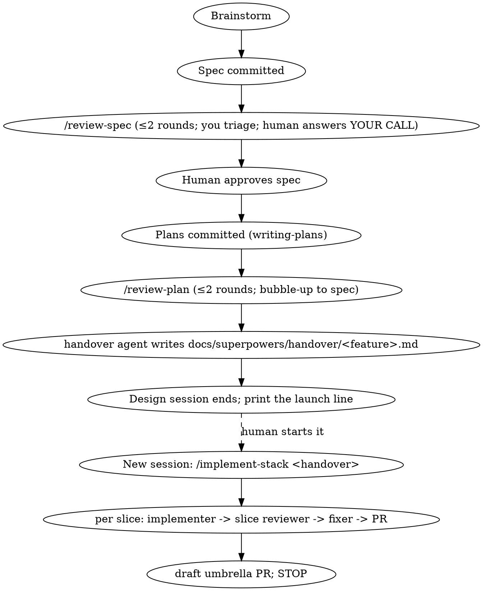

# HITL — human-in-the-loop delivery

These rules apply to **every** feature and bugfix in this repository. Repo-specific
conventions (stack, local gates, domain) live in `AGENTS.md`; domain ground truth, when a
repo has one, lives in `CONTEXT.md`. This file is the portable doctrine: what the agents
and commands under `.claude/` read by name.

## Delivery chain

<!-- hitl:knob small-lane -->
Every feature and behaviour change in this repository runs the chain below. There is no
smaller lane: "bounded", "one field", "obvious" and "trivial" are descriptions of the
artefacts' *size*, never grounds to skip a gate. The brainstorming skill's bounded path is
not available here.

<!-- hitl:knob review-rounds -->

### Gates and who decides

- **Spec gate.** After the spec is committed, run `/review-spec`. You triage every finding
  (APPLY / YOUR CALL / DECLINE); design decisions go to the human one at a time. Stop for
  approval only after the loop has converged.
- **Plan gate.** After the plans are committed, run `/review-plan`. Same loop; a plan
  finding that is a spec gap is fixed in the spec and recorded there (bubble-up). On
  convergence the handover agent runs by itself and the session ends.
- **Code gate.** The PR is the gate. The orchestrator (`/implement-stack`) and its reviewer
  (`/review-slice`) decide every code-level finding and record declines in the PR body
  under `## Review decisions`, in plain words about what a user or the data would
  experience — never code vocabulary.
<!-- hitl:knob review-rounds -->
- **Rounds.** One is too few, two is good, three is too many. Round 2 runs only if triage
  changed the artefact. Never a third.

### The Stop hook

You cannot end your turn while a spec or plan in the working tree lacks a
`**Reviewed:**` line. The loop commands write that line when a round completes (or a
`failed` line when the reviewer produced nothing). A pre-workflow artefact is hand-marked
`**Reviewed:** grandfathered (<date>)`. Do not fight the hook; run the loop.

### Terminal states

- Design session: the spec awaiting approval; the plans awaiting the handover; a round-2
  blocker the human must resolve.
- Implementation session: the whole stack done with a draft umbrella PR open; a blocked
  implementer; a fixer that cannot reach green; a plan that needs a design change.
- Nothing merges. The human reviews the stack.

### Rationalizations — and why they are wrong here

| Thought | Reality |
|---|---|
| "It's bounded / one field / a config change — no spec" | Size shrinks the spec, never the gate. Write the short spec; run the loop. |
| "I'll write the plan in the same turn as the spec" | Two deliverables, one gate between them. Commit the spec, run `/review-spec`, stop. |
| "The design is obvious, I'll start while they read" | Starting is the thing being approved. Present, then wait. |
| "The reviewer said APPROVED, so we're done" | The verdict is noise across runs. Triage decides; the round rule decides. |
| "This finding is accurate, so fold it in" | Accurate is not the bar. Scope, altitude and proportionality are. |
| "The reviewer flagged a gap; fix it in this slice" | Check the stack table first. If a later slice owns it, it is DEFERRED. |
| "The hook is blocking me for no reason" | It found an unreviewed artefact. Run the loop or mark the artefact. |

### Where things live

`.claude/agents/` (reviewer, implementer, fixer, handover agents) · `.claude/commands/`
(`/review-spec`, `/review-plan`, `/handover`, `/implement-stack`, `/umbrella-pr`) ·
`.claude/hooks/` and `.claude/settings.json` (the Stop hook above, declared for everyone who
clones the repo) · `.claude/review-context.md` (repo-specific reviewer context) ·
`.claude/reviews/` (gitignored review output) · `scripts/hitl/` (the PR shim and the wipe
script) · `.claude/hitl.json` (install metadata written by `/hitl:init`, read by nothing at
run time) · `docs/superpowers/` (transient specs, plans, handover).

## Feature branches

- **Always** create a dedicated feature branch off up-to-date `main` before
  implementation. Do not commit feature work directly on `master` / `main`.
- Name it by intent, e.g. `feat/expense-details`, `fix/port-in-use`.
- That branch is the **integration target**, not a slice. It holds the umbrella
  spec + slice plans. Slice 1 is a *separate* branch; do not open
  `feat/<topic> → main` as the first slice PR.
  A one-slice feature is stacked like any other: one slice branch on the feature branch,
  one draft umbrella PR opened after the slice merges into it — its diff is never empty
  because the feature branch carries the spec, the plan and the handover document.
- Prefer small, frequent commits (one logical TDD cycle per commit is fine).

## Stacked PRs (slices land on the feature branch)

- Each slice gets its own branch (`feat/<topic>-slice-N` or `slice/...`), created
  off the previous slice (slice 1 off the feature branch).
- Open each slice PR against its **parent**, never against `main`:
  slice 1 → feature branch; slice N → slice N−1, or the feature branch once slice N−1 has
  merged into it. Targeting the parent keeps each PR's diff to just that slice.
- Merge slices into the feature branch in order (1 → N). Rebase the feature
  branch from `main` as needed. Then open one PR: feature branch → `main`.
- The handover document (`docs/superpowers/handover/<feature>.md`, written by the handover
  agent) carries the stack table — branch, parent, status, owns — and `/implement-stack`
  reads branch names and parents from it, never from a rule of its own. Once a slice merges,
  the next slice's parent is the feature branch.

## Test-driven development

- **Every behavior change is TDD.** The failing test is written at the layer the repo's
  standards name for that kind of change (`AGENTS.md`); the tier order there decides.
- Vertical slices only: one failing test → minimal implementation → pass → commit.
  Do **not** write a bulk of tests first and implement afterward.
- Prefer tests that exercise public behavior (HTTP for an API; user-visible UI or schema
  contracts for a web app) over tests coupled to private internals.
- Red → green → refactor. Never skip the failing-test step.
- If the app under change has no test runner yet, add the minimal harness as part
  of the first TDD task for that app — do not ship untested logic.
- **What the mandate covers.** Application behaviour, and repository scripts with
  behaviour of their own — including `.claude/hooks/` and the scripts this workflow
  installs. Pipeline and hook *configuration* — workflow YAML, CI runner scripts, commit-hook
  config, linter and formatter configs — is validated by a human watching it run, never by
  a test written to satisfy this rule. A test whose only purpose is to make CI code "TDD"
  is a finding, not a merit.
- **The mandated local gates** are the ones `AGENTS.md` names for this repository. CI is
  the backstop, not the first run: they are run before a PR opens.

## Specs and plans

- Specs and plans are **transient per-feature artifacts**, not permanent records.
  They live under `docs/superpowers/specs/` and `docs/superpowers/plans/` for the
  life of a feature branch; a workflow deletes them once the feature lands on `main`, and
  where no such job is installed they are deleted by hand after merge.
- Nothing durable may reference them. A rule that must outlive the feature belongs
  in `CONTEXT.md` (domain), `AGENTS.md` (repo standards) or this file (workflow) — not in a
  spec.
- Follow the plan task-by-task; keep Global Constraints in the plan aligned with
  this file and `AGENTS.md`.
- Every slice plan declares **`**Owns:**`** in its header block — the lines between
  the `#` title and the first `##` heading — stating the one capability that slice is
  responsible for. The handover agent copies it into the stack table's `owns` column,
  which the slice reviewer reads to tell a deferred gap (DEFERRED) from a forgotten one
  (MISSING), and only the header block is parsed, so an `Owns:` line quoted inside a task
  body is ignored.
- Plans in a stack are named `<YYYY-MM-DD>-<feature>-slice-<N>-<label>.md`, where
  `<feature>` and `<label>` are non-empty **kebab-case** and `<N>` is a positive
  integer with no leading zeros. `<feature>` is the stack key and the date is not
  part of it, so plans written on different days still group together. At most one
  in-flight stack may use a given `<feature>` key at a time.
  The handover agent derives branch names from these labels, so the naming discipline
  lives here and in plan review.
- A spec is named `docs/superpowers/specs/<YYYY-MM-DD>-<topic>-design.md`. The review
  commands derive the review file's topic from these names — the spec basename without its
  date and `-design` for a spec review, `<feature>` for a plan review, `<feature>-slice-<N>`
  for a slice review — and write it to the gitignored `.claude/reviews/`.
- Every spec and plan carries a `**Reviewed:**` header line (between the title and the
  first `##`) once its review loop has run: `round N (<date>)`, `round N failed (<date>) —
  <reason>`, or `grandfathered (<date>)`. A `Stop` hook refuses to end a session's turn
  while an artefact in the working tree lacks it.

## Review gates

Three cold reviewers, all Claude subagents under `.claude/agents/`, all reporting in one
taxonomy of six types — MISSING · UNCLEAR · CONFLICTS · BREAKS · UNPROVEN · MIS-SLICED —
plus DEFERRED, which only the slice reviewer may use (a spec or plan review has no stack
table to defer against).

<!-- hitl:knob reporting-cap -->
All three carry three severities and a reporting cap (every blocker, at most five majors,
minors listed one line each):

<!-- hitl:knob review-rounds -->
- `/review-spec` — the umbrella spec, at most two rounds; the human answers YOUR CALL
  findings one at a time.
- `/review-plan` — every slice plan of the feature as one batch against the spec, at most
  two rounds; a plan finding that is a spec gap is fixed in the spec (bubble-up) without
  reopening its review. On convergence the handover agent writes the handover document.
- `/review-slice` — one slice branch's merge-base diff against its parent, its plan and the
  stack table; run once per slice by `/implement-stack` before the PR opens. A gap a later
  slice owns is DEFERRED and is never fixed in the current slice.

<!-- hitl:knob review-rounds -->
Round 2 runs only if triage changed the artefact. Never a third round: one is too few, two
is good, three is too many. The reviewer's verdict is not a convergence signal; triage is.
Review output is gitignored under `.claude/reviews/`; repo-specific reviewer context lives
in `.claude/review-context.md`.

## Pull requests

- Every PR body includes a line pointing to the slice's plan, so the slice reviewer
  and human reviewers can check the diff against what was planned:

  `Plan: docs/superpowers/plans/<file>.md`

  Omit only when there is genuinely no plan (e.g. this convention's own bootstrap
  PR); the reviewer then falls back to searching `docs/superpowers/plans/`.
<!-- hitl:knob pr-body-sections -->
- Every PR body answers, briefly and in plain words (explain it as you would to an
  intern), concise and realistic — do not invent rationale to fill space; if a section
  has nothing meaningful to say (e.g. a trivial change), one honest line is fine:
  - **What** — what this change is.
  - **Why** — why it is needed.
  - **How** — the approach taken, and why this one over an alternative *if* a real
    choice was made.
<!-- hitl:knob pr-body-sections -->
- A PR opened by `/implement-stack` also carries `## Review decisions`: every declined or
  deferred review finding in plain words — the concern as a user or the data would
  experience it, the decision, the reason — never file, function or test names. A human
  overturns one by commenting on the PR.

## Delivery slices (small PRs)

- **This is the hard rule.** **The floor on thinness: the thinnest change a behavior test can still prove.**
  Slice by *capability* (a thread through the layers that a test can exercise
  end-to-end), never by horizontal *layer*. Legit thinning axes: copy/compute
  depth (e.g. create empty → fill shallow → fill deep) and read-before-write
  (list → create → view → mutate). Below the floor lies the horizontal trap — a
  migration split from its first consumer, or a resolver split from its route:
  smaller, but no observable behavior to test, integration risk deferred, not
  independently meaningful. Don't cut there.
- Decompose any feature too large for a single reviewable PR into tracer-bullet
  vertical slices.
- Write **one umbrella spec** (whole design + a "Delivery slices" section), then
  **one implementation plan per slice**. Multiplying specs is overkill — the
  per-slice plan is the lever on PR size.
<!-- hitl:knob file-tripwire -->
- Each slice is one PR, sized by **capability**, not by file count. **~20 files
  including the spec/plan docs and tests is a tripwire, not a cap**: crossing it
  means stopping to write a one-line justification in the plan's Global
  Constraints, not splitting further. **Never split horizontally to get under
  it** — a slice below the thinness floor above is worse than a wide one.
  Stack it onto the feature branch (see Stacked PRs above), not onto `main`.
  Repo conventions still hold (one file per unit the repo's standards name); if honoring
  them pushes past the tripwire, cross it and say why.
- Keep intermediate slices non-breaking where cheap (additive change now + a later
  cleanup slice) so the app stays green between merges.

## Load-bearing invariants

A script or a command parses each of these by name. `/hitl:customize` refuses them; change
one together with its parser, by PR.

- The `**Reviewed:**` header line of a spec or plan — the Stop hook and the review commands.
- The `**Owns:**` header line of a slice plan — the handover agent and the slice reviewer.
- The `Plan:` line of a PR body — the slice reviewer.
- The spec and plan filename patterns `<YYYY-MM-DD>-<topic>-design.md` and
  `<YYYY-MM-DD>-<feature>-slice-<N>-<label>.md` — the review commands, the handover agent.
- The stack-table columns `slice | plan | branch | parent | status | owns` —
  `/implement-stack` and the slice reviewer.
- The seven finding-type names MISSING · UNCLEAR · CONFLICTS · BREAKS · UNPROVEN · MIS-SLICED · DEFERRED —
  every review command's triage.
- The `docs/superpowers/` path — the Stop hook, the wipe script, every command.
